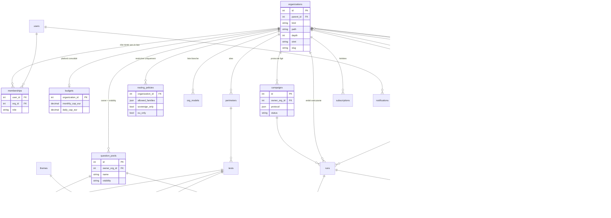

# ADR-089 — Modèle cible pour l'échelle ministérielle et interministérielle

- **Statut** : Acceptée (2026-10-02), arbitrages validés par Bertrand Matge
- **Dépend de** : ADR-076 (historique inviolable), ADR-077 (multi-tenant, rôles), ADR-078 (BYOK),
  ADR-080 (OpenRouter, coût réel), ADR-086 (auth applicative, OIDC), ADR-088 (stack conservée,
  API first, cible Nubo)
- **Schémas** : [`docs/architecture.md`](../architecture.md)

## 1. Contexte

Le pilote vise un ministère, puis plusieurs. Les besoins exprimés : multi-objets (entité,
thème, site), hiérarchie d'entités (ministère > direction > service), budgets définis par
l'entité supérieure, multi-fournisseurs LLM avec contrats et clés unitaires, pools de
questions regroupables, notifications et retours (question toujours fausse, quota atteint).

Le modèle actuel est plat : `Organization` sans parent, `Perimeter` rattaché à une org,
`Budget` par org, `OrgCredential` par couple org et modèle, tests propriété d'une org.
Tout ce qui suit s'appuie sur une seule décision structurante : la hiérarchie des entités.

## 2. Décisions

### 2.1 Hiérarchie des entités — `parent_id` + chemin matérialisé

`Organization` devient un nœud d'arbre : `parent_id` nullable, `kind` (ministère,
direction, service, autre), `path` texte des identifiants ancêtres (ex. `12/45/78`),
`depth`. Les organisations existantes deviennent des racines sans migration de données.

- Descendants : `WHERE path LIKE '12/%'` indexé ; ancêtres : décomposition du `path`.
  Une CTE récursive reste possible. Aucune extension PostgreSQL requise : on ne connaît pas
  encore les extensions activées sur le Postgres managé Nubo, `ltree` est donc écarté.
- Déplacement d'un nœud : réécriture du `path` du sous-arbre dans une transaction, opération
  rare et administrative.
- `siret` optionnel sur l'entité, pour le rattachement ProConnect (§2.7).

### 2.2 Résolveur unique de paramètres hérités

Une fonction `effective_setting(org, key)` remonte la chaîne des ancêtres et renvoie la
première valeur définie. Elle sert à tous les paramètres hérités : plafond budgétaire,
liste blanche de modèles, politique de routage LLM, contrat ou credential applicable,
destinataires de notifications. Une valeur posée sur un nœud surcharge celle du parent,
jamais au-delà de ce que le parent autorise (une liste blanche enfant ⊆ liste blanche
parent ; une politique de routage ne peut qu'être plus restrictive).

### 2.3 Budgets — plafond consolidé souple

- Le plafond d'une entité (mois, jour) s'applique à sa **dépense consolidée** : elle-même
  plus tous ses descendants.
- Les plafonds des enfants sont **optionnels**. Une entité sans budget propre est contrainte
  par le premier plafond trouvé en remontant.
- `check_budget` vérifie toute la chaîne des ancêtres : un run est refusé si **un** plafond
  consolidé serait dépassé, et le motif nomme l'entité en cause.
- `UsageRecord` garde `organization_id` de l'entité exécutante ; la consolidation est une
  agrégation par préfixe de `path`. Alertes à 80 % et 100 % (§2.8).
- Les enveloppes strictes (allocation explicite, somme des enfants ≤ parent) sont
  écartées pour le pilote : elles obligent à tout allouer avant d'ouvrir un service.

### 2.4 Rôles — hérités vers le bas, définis dans l'application

- Un `membership` sur une entité vaut pour elle **et tous ses descendants**. Le rôle
  effectif sur une entité est le maximum des rôles portés sur la chaîne des ancêtres.
- Délégation : chaque `org_admin` nomme les membres de son sous-arbre, jamais au-dessus.
- L'admin plateforme reste un attribut utilisateur (`users.is_platform_admin`), hors arbre.
- Les trois rôles actuels suffisent au pilote : `org_admin`, `editor`, `viewer`. Un rôle
  `annotator` (vérité terrain et gold set uniquement) est réservé pour la phase suivante.

### 2.5 Pools de questions — référence et portée de visibilité

- Nouvel objet `question_pools` : propriétaire (`owner_org_id`), `visibility` ∈ {`private`,
  `descendants`, `all`}, thèmes, description. Table de liaison `pool_tests` ; un pool peut
  inclure d'autres pools (`pool_includes`), cycle interdit.
- Une entité **exécute** un pool visible sans le copier. Les tests gardent leur
  propriétaire, les `runs` et `run_results` portent l'entité exécutante. Une correction de
  la vérité terrain profite à tous ; l'historique reste intact (ADR-076 : nouvelle version
  de `test_ground_truth`, jamais de réécriture).
- `Perimeter` est conservé comme objet **site** (il porte déjà `kind` et `home_url`) et
  gagne `domains` (liste des domaines officiels à surveiller).
- Les **thèmes** sont des étiquettes transverses (`themes`, `test_themes`,
  `perimeter_themes`), pas un niveau de hiérarchie.
- La copie à l'import est écartée : divergence des réponses attendues, comparaisons
  impossibles.

### 2.6 Fournisseurs LLM — objet contrat

`OrgCredential` est remplacé par `llm_contracts` : entité porteuse, fournisseur (`family`),
libellé (marché, référence), `base_url`, clé chiffrée Fernet, en-têtes, `valid_from` /
`valid_to`, plafond propre optionnel, `is_active`. Un contrat est **hérité par les
descendants** via le résolveur. `UsageRecord` gagne `contract_id` pour l'imputation.

La cascade de `client_for_model` devient : contrat de l'entité ou d'un ancêtre pour cette
famille → configuration du modèle → secret plateforme. OpenRouter reste le contrat
plateforme par défaut ; un ministère peut poser son propre contrat Mistral, Albert ou
OpenRouter, et ses services en héritent.

**Politique de routage** par entité (héritée, restrictive uniquement) : fournisseurs
autorisés, souverain obligatoire ou non, hébergement hors UE interdit ou non. Vérifiée au
lancement comme la liste blanche.

### 2.7 Identité ProConnect — authentifie, n'habilite pas

- ProConnect fournit `sub`, email, nom, prénom, `siret`, `idp_id`. Aucun `groups`. Les
  habilitations vivent dans l'application (§2.4). Les promotions par groupe fournisseur
  restent des mécanismes transitoires opt-in (PR #42).
- Clé de rattachement technique : `(oidc_issuer, sub)`, pas l'email, qui change avec les
  mutations.
- Le `siret` **propose** un rattachement à l'entité correspondante ; un `org_admin` valide
  et choisit le rôle. Jamais d'attribution automatique.
- Le `siret` est relu à chaque connexion ; une divergence avec les entités de l'utilisateur
  est signalée aux administrateurs pour revue. Aucune révocation automatique.

### 2.8 Notifications et retours

- Table `notifications` (destinataire, entité, type, charge utile, lu) et `subscriptions`
  (entité, type, canal, destinataires, héritées). Canaux pilote : dans l'application et
  email ; webhook générique ensuite (Tchap, outils ministériels).
- Événements : quota à 80 % et 100 %, run en échec, clé ou contrat expirant, juge
  indisponible, **question récurremment fausse** (N derniers runs sous un seuil pour un
  couple test et modèle), chute de la part de citations vers les domaines du site.
- Les détecteurs tournent dans le worker, après chaque évaluation, et n'écrivent que des
  notifications : ils ne modifient jamais un résultat.
- Retours humains : les annotations gold existantes deviennent un flux de **signalement**
  (« réponse attendue douteuse », « citation hors sujet ») rattaché au test et visible par
  le propriétaire du pool.

### 2.9 Ce que l'échelle impose en plus

- **Campagnes** : un protocole figé (pools, modèles et versions, juges, prompts, fréquence)
  défini par une entité et exécuté par ses descendants, pour des résultats comparables.
- **Cycle de vie des questions** : brouillon → validée → publiée → retirée, avec un
  propriétaire métier qui approuve la réponse attendue.
- **Juges** : versions épinglées par campagne ; rejuger un historique crée de nouvelles
  évaluations, n'écrase rien ; jeux de calibration par domaine et suivi de l'accord
  juge / humains dans le temps.
- **Exploitation** : file de jobs avec priorité et équité entre entités, limitation de
  débit par contrat, partitionnement mensuel de `run_results` et `run_evaluations`,
  archivage, export ouvert agrégé.
- **Conformité** : journal de tout envoi vers un fournisseur externe, rétention, RGAA,
  homologation, registre des traitements pour les comptes.

## 3. Modèle de données cible

Tables existantes conservées telles quelles : `users`, `auth_tokens`, `invitations`,
`audit_log`, `models`, `model_pricing`, `scheduled_runs`, `prompt_types`,
`evaluation_prompts`, `gold_annotations`, `run_results`, `run_evaluations`.
`org_credentials` migre vers `llm_contracts` (lecture des deux pendant une version).

## 4. Pilote ou interministériel

| Capacité | Pilote (un ministère) | Interministériel |
|---|---|---|
| Hiérarchie, résolveur, rôles hérités | ✔ | ✔ |
| Budget consolidé souple + alertes | ✔ | enveloppes strictes si demandé |
| Pools par référence, thèmes, sites | ✔ | ✔ |
| Contrats LLM, politique de routage | ✔ (un contrat plateforme + contrats ministère) | ✔ |
| ProConnect, rattachement par `siret` proposé | ✔ | ✔ |
| Notifications app + email, détecteur « toujours faux » | ✔ | webhooks, digests |
| Campagnes et cycle de vie des questions | minimal (statut publié / retiré) | complet |
| Partitionnement, priorité et équité, export ouvert | — | ✔ |
| Refacturation par contrat | showback | chargeback |

## 4bis. Mise en œuvre de E1 (amendement 2026-10-03)

Arbitrages validés : les organisations existantes deviennent des **racines de type
« autre »** (non qualifiées, à requalifier par un admin plateforme) ; le résolveur est
livré avec un **premier consommateur, la liste blanche des modèles**.

- Révision Alembic `0002` : `parent_id`, `kind` (CHECK ministere / direction / service /
  autre, défaut autre), `path` matérialisé au format `/12/45/78/` (index
  `text_pattern_ops`, sans piège de préfixe `/1/` vs `/12/`), `depth`, `siret` (CHECK 14
  chiffres, indexé, non unique : plusieurs entités peuvent partager un établissement).
  Profondeur maximale : 7 niveaux.
- `geoeval/web/hierarchy.py` : lecture (fil d'Ariane, chaîne de résolution, enfants,
  descendants), création, déplacement d'un sous-arbre (cycle → 409, réécriture de `path`
  et `depth` en une requête), qualification. Validation complète avant toute écriture.
- Résolveur : `resolve_nearest` (première valeur définie en remontant) et
  `resolve_restrictive` (combinaison de toutes les valeurs définies, ici intersection).
- **Liste blanche héritée** : liste effective = intersection des listes posées sur
  l'entité et ses ancêtres. L'org_admin échappe à la liste de SON entité (il la gère) mais
  reste borné par celles des ancêtres ; seul l'admin plateforme voit tout. Sans liste sur
  la chaîne : catalogue global, comportement inchangé pour toutes les données existantes.
  Conséquence assumée : une ligne explicitement décochée par une sous-entité reste
  décochée si le parent élargit plus tard sa liste.
- En E1, seul l'admin plateforme crée, qualifie et rattache des entités (UI
  `/admin/organizations`, API `POST /orgs`, `PATCH /orgs/{slug}`). La délégation aux
  org_admin vient avec les rôles hérités (E2).

## 4ter. Mise en œuvre de E2 (amendement 2026-10-03)

Arbitrages validés : un org_admin **crée et déplace dans son sous-arbre** ; un **jeton
d'API hérite vers le bas** comme un utilisateur.

- **Rôle effectif** (`tenancy.resolve_role`) : maximum des rôles posés sur l'entité et ses
  ancêtres ; à rôle égal, l'ancre la plus haute. Jamais vers le haut ni vers une branche
  sœur. Le rôle est un `EffectiveRole` (sous-classe de `str`) qui porte l'entité
  d'ancrage : tout le code existant qui compare le rôle fonctionne tel quel. L'admin
  plateforme vaut org_admin implicite ancré à la racine.
- Appliqué partout : dépendances UI (`require_org`, `public_org`, `require_role`), API
  (session et jeton), accueil et `GET /orgs` (adhésions + sous-arbres). Un jeton créé sur
  le ministère agit sur tous ses services ; un jeton créé sur un service n'agit pas sur sa
  direction (404 sans divulgation).
- **Délégation de structure** (`tenancy.can_create_under` / `can_qualify` /
  `can_restructure`) : un org_admin crée sous n'importe quel nœud de son sous-arbre,
  qualifie les entités STRICTEMENT sous son ancre, déplace une entité d'un nœud de son
  sous-arbre vers un autre. Jamais de racine, jamais hors périmètre, jamais son entité
  d'ancrage : cela reste à l'admin plateforme. UI : paramètres › sous-entités ; API :
  `POST /orgs`, `PATCH /orgs/{slug}` (session ou jeton org_admin).
- **Liste blanche d'un org_admin hérité** : il ignore les listes posées dans son
  sous-arbre (ancre comprise), qu'il gère, et reste borné par celles posées au-dessus de
  son ancre. editor et viewer restent bornés par toute la chaîne.
- Les membres hérités sont affichés en lecture seule dans les paramètres de chaque entité,
  avec l'entité d'origine du rôle.

## 4quater. Mise en œuvre de E3 (amendement 2026-10-03)

Arbitrages validés : alertes **dans l'application et par email** ; une exécution
programmée qui dépasserait un plafond est **sautée et tracée**.

- **Budget consolidé** (`geoeval/web/budget.py`) : un plafond s'applique à la dépense de
  l'entité et de tout son sous-arbre (jointure sur `path`). `check_budget` parcourt la
  chaîne (l'entité puis ses ancêtres) et refuse si UN plafond, journalier ou mensuel,
  serait dépassé ; le motif nomme l'entité porteuse quand ce n'est pas l'entité
  elle-même. Plafonds des sous-entités optionnels ; le plus contraignant s'applique.
- **Alertes** (`geoeval/web/budget_alerts.py`, table `budget_alerts`, révision `0003`) :
  seuils 80 % et 100 % par plafond et par période calendaire (clé calculée par la base,
  même horloge que la dépense). L'unicité en base garantit une seule alerte par seuil et
  par période. Évaluées en fin de chaque job et après un saut du planificateur.
  Destinataires : org_admin directs de l'entité porteuse, à défaut ceux de l'ancêtre le
  plus proche qui en a. Statut d'envoi tracé (`sent`, `not_configured`, `no_recipient`,
  `failed`).
- **Email** (`geoeval/web/mailer.py`) : SMTP de la bibliothèque standard, sans
  dépendance ; inactif tant que `GEOEVAL_SMTP_HOST` est vide, les alertes restant
  visibles dans l'application. Un échec d'envoi ne casse jamais un job.
- **Application** : bandeaux 80 % / 100 % sur le tableau de bord (membres seulement), la
  page de lancement et la page budget ; la page budget montre plafonds propres et hérités,
  dépense consolidée et propre, alertes envoyées. API `GET /orgs/{slug}/budget` (editor+).
  Jauges `geoeval_budget_spent_eur`, `geoeval_budget_cap_eur`, `geoeval_budget_ratio`.
- **Planificateur** : le budget est revérifié à l'échéance ; si l'exécution dépasserait
  un plafond, elle n'est pas mise en file, `last_skipped_at` / `last_skip_reason` sont
  posés sur la planification, une ligne d'audit `skip_budget` est écrite, la prochaine
  échéance est recalculée (un one-shot sauté est clos). Une exécution réussie efface le
  motif. Comble le trou relevé au lot 1.3a.

## 4quinquies. Mise en œuvre de E4 (amendement 2026-10-03)

Arbitrages validés : une entité exécute un pool en l'**abonnant à un de ses périmètres** ;
les thèmes forment un **catalogue global géré par l'administration plateforme**.

- **Schéma** (révision `0004`) : `question_pools` (propriétaire, nom unique par entité,
  `visibility` ∈ {`private`, `descendants`, `all`}), `pool_tests`, `pool_includes`
  (inclusion sans cycle, profondeur bornée à 10), `perimeter_pools` (abonnements),
  `themes`, `test_themes`, `perimeter_themes`, et `perimeters.domains` (JSONB).
- **Pools** (`geoeval/web/pools.py`) : un pool ne contient que des questions de son
  entité propriétaire. `descendants` = l'entité et tout son sous-arbre ; le partage ne
  remonte jamais. Gestion : éditeur+ de l'entité propriétaire ; abonnement : éditeur+ de
  l'entité du périmètre, sur un pool qui lui est visible.
- **La composition n'élargit jamais la visibilité** : à la résolution, un pool atteint par
  inclusion n'est suivi que s'il est lui-même visible de l'entité qui exécute. Réduire la
  visibilité d'un pool coupe ses questions aux abonnés qui ne le voient plus ; l'abonnement
  reste, marqué « plus partagé ».
- **Questions effectives** d'un périmètre = ses questions propres + celles des pools
  abonnés (dédoublonnées, actives et notables). Règle unique `launching.tests_for_run`,
  utilisée par la validation du lancement, le devis et le contrôle budgétaire (lancement,
  planification, échéance du planificateur) et le worker (résolution à l'exécution : un
  pool modifié entre la programmation et l'échéance est pris tel qu'il est à l'échéance).
- **Historique** : les runs portent l'entité exécutante et référencent les questions, pas
  le pool. Supprimer un pool supprime ses abonnements et inclusions, jamais un run. Les
  statistiques par question d'une entité filtrent sur ses runs, plus sur le propriétaire
  de la question (sinon les questions de pool disparaîtraient de ses tableaux de bord).
- **Thèmes** (`geoeval/web/themes.py`) : catalogue global (slug unique), création,
  renommage et suppression réservés à l'administration plateforme (UI `/admin/themes`,
  API `POST/PATCH/DELETE /themes`) ; lecture pour tout principal authentifié. Les éditeurs
  étiquettent questions et périmètres ; filtre par thème sur la liste des questions et
  `GET /questions?theme_id=`.
- **Domaines officiels** : liste normalisée (hôte en minuscules, sans `www.`, 50 au plus)
  saisie sur le périmètre. Le détail d'un run affiche la part des citations pointant vers
  ces domaines ou leurs sous-domaines (calcul à la lecture, avec les domaines courants du
  périmètre ; aucune donnée de run n'est réécrite). Même valeur dans l'API (`official_share`).
- **API v1** : `/orgs/{slug}/pools` (CRUD, `questions`, `includes`),
  `/orgs/{slug}/perimeters/{id}/pools` (abonnements), `/orgs/{slug}/perimeters/{id}/effective-questions`,
  `/themes` ; `domains` et `theme_ids` sur périmètres et questions.

## 4sexies. Mise en œuvre de E5 (amendement 2026-10-03)

Arbitrages validés : un contrat couvre une **famille**, restreignable à des modèles ; la
contrainte « souverain / hébergement UE » vise les **notateurs** seulement ; un contrat
expiré ou au plafond **bloque** (jamais de repli silencieux) ; les clés BYOK sont
**converties** en contrats, `org_credentials` restant intacte pour un retour arrière.

- **Schéma** (révision `0005`) : `llm_contracts` (entité, famille, libellé, référence,
  `base_url`, clé Fernet, en-têtes, `model_ids`, `valid_from` / `valid_to`, `cap_eur` sur
  toute la durée, `hosting`, `sovereign`, `is_active`), `routing_policies`,
  `usage.contract_id`, `models.hosting` (Albert marqué UE). Chaque ligne `org_credentials`
  devient un contrat restreint à son modèle, avec le même blob chiffré. `org_credentials`
  n'est plus lue ; sa suppression viendra dans une révision ultérieure.
- **Résolution** (`geoeval/web/contracts.py`) : on remonte la chaîne ; au premier niveau qui
  porte un contrat actif couvrant le modèle, la recherche s'arrête. En vigueur et sous son
  plafond : il est utilisé (à un même niveau, un contrat restreint prime sur un contrat de
  famille). Sinon l'appel est bloqué avec un motif qui nomme le contrat et l'entité. Un
  contrat désactivé est ignoré : c'est l'échappatoire explicite. Deux contrats actifs d'une
  même entité ne peuvent pas se chevaucher (dates et modèles) ; un successeur daté est permis.
  Un contrat qui porte de la consommation ne se supprime pas, il se désactive.
- **Imputation** : `usage.contract_id` et `billed_to = 'contract'` (les lignes `byok`
  historiques ne sont pas réécrites). Le devis indique le contrat de chaque ligne. La
  dépense sous contrat reste comptée dans le budget consolidé de l'entité.
- **Politique de routage** (`geoeval/web/routing.py`) : fournisseurs autorisés
  (intersection sur la chaîne, IA évaluées et notateurs), notateurs souverains, notateurs
  hébergés dans l'UE (vrais dès qu'un niveau les pose). Souveraineté et hébergement
  s'évaluent sur l'appel effectif : le contrat retenu peut les déclarer, sinon le modèle ;
  un hébergement inconnu est refusé quand l'UE est obligatoire. La politique s'applique à
  tous, administrateurs compris.
- **Contrôles** : `launching.check_compliance` puis le plafond des contrats sur le devis
  imputé, avant le budget, dans le chemin commun (lancement, « exécuter maintenant »,
  création de planification, échéance du planificateur). Une échéance refusée est sautée
  et tracée (`skip_routing`, `skip_contract`). À l'exécution, `client_for_model` bloque
  aussi un contrat devenu inutilisable (le job échoue avec le motif). Les formulaires ne
  proposent que les modèles conformes.
- **UI** : *Paramètres › Contrats LLM et politique de routage* (org_admin) — contrats propres
  et hérités, consommation et plafond, état (en vigueur, à venir, expiré, plafond atteint,
  désactivé), clé effectivement utilisée pour chaque IA ; formulaire de modèle enrichi
  (hébergement, souverain). **API v1** : `/orgs/{slug}/contracts` (CRUD, clé en écriture
  seule), `/orgs/{slug}/contracts/resolution`, `/orgs/{slug}/routing-policy` (GET editor+,
  PUT org_admin).

## 4septies. Préparatifs de E6 (amendement 2026-10-03)

ProConnect n'est pas encore branché : E6 est découpé, seule la **version minimale** est
livrée. Elle consolide l'identité utile à tout fournisseur OIDC. Arbitrages validés : un
email modifié chez le fournisseur **met à jour** le compte s'il est libre ; un fournisseur
peut être déclaré **de confiance** pour l'email (opt-in, activé par le profil ProConnect).

- **Clé stable `(issuer, sub)`** (`oidc.resolve_user`, déjà en base depuis ADR-086) :
  1. Identité connue : connexion, sans exiger l'email. Un nouvel email attesté et libre
     remplace l'ancien (`oidc_email_updated`) ; s'il est pris, l'ancien est gardé et le
     conflit tracé (`oidc_email_conflict`).
  2. Identité inconnue : rattachement par email **attesté** seulement. Refus si le compte
     est déjà lié à un autre `sub` du même fournisseur (anti-takeover, le lien n'est jamais
     écrasé). Un compte lié à un autre fournisseur est re-rattaché (migration Authentik →
     ProConnect, `oidc_linked`).
  3. Aucun compte : création (`oidc_created`).
- **Profils et correspondance des claims** : `OIDC_PROFILE` (`generic` | `proconnect`)
  fixe libellé, scopes, confiance dans l'email et noms des claims (`usual_name`, `siret`,
  `idp_id` pour ProConnect) ; chaque `OIDC_*` reste prioritaire, une variable vide vaut
  « non posée ». Le `siret` et l'`idp_id` sont lus mais pas encore exploités.
- **Restent pour le branchement réel** : rattachement proposé par `siret` et file de
  validation par les org_admin, relecture du `siret` à chaque connexion et signalement des
  divergences, inscription du client ProConnect (URL de retour, logout fédéré). ProConnect
  renvoie son endpoint `userinfo` en JWT signé : le callback devra l'appeler et le
  vérifier si l'`id_token` ne porte pas les claims, ce qui n'est pas fait ici.

## 4octies. Mise en œuvre de E7 (amendement 2026-10-03)

Arbitrages validés : destinataires **par rôle selon le type**, avec une préférence d'email
par utilisateur (pas encore de table d'abonnements partagés, elle viendra avec les
webhooks) ; seuil « question toujours fausse » **global, surchargeable par entité et
hérité** ; périmètre **socle** ; emails **immédiats**, avec un défaut par type.

- **Schéma** (révision `0006`) : `notifications` (destinataire, entité, type, titre, corps,
  lien, charge utile, `dedup_key`, statut d'email, lu), `notification_preferences`
  (utilisateur × type → email), `detector_settings` (N et seuil, NULL = hérité).
- **Émission** (`geoeval/web/notifications.py`) : destinataires = membres directs de
  l'entité ayant un rôle du type (budget et contrats : org_admin ; échec et « toujours
  faux » : editor et plus), à défaut ceux de l'ancêtre le plus proche qui en a.
  L'in-app est toujours actif ; un email groupé part aux destinataires qui l'ont activé
  (défaut : oui pour budget, contrats et échec ; non pour « toujours faux »). `dedup_key`
  rend l'émission idempotente par destinataire. Compteur `geoeval_notifications_total{kind}`.
- **Types livrés** : `budget_threshold` (les alertes E3 passent désormais par les
  notifications, `budget_alerts.email_status` gagne `disabled`) ; `job_failed` (couvre le
  notateur indisponible, émis par le worker) ; `contract_expiring` (J-30 puis J-7) et
  `contract_expired` (vérifiés par le planificateur, au plus une fois par heure) ;
  `always_wrong` (après chaque évaluation, dans le worker).
- **Détecteur « toujours faux »** (`geoeval/web/detectors.py`) : pour un couple (question,
  IA évaluée) d'une entité, les N dernières évaluations sous le seuil (moyenne des
  notateurs, note de réponse sur 10). Une alerte par série : la clé porte le premier run de
  la série, qui ne change pas tant que la série continue. Défaut plateforme 3 et 5/10
  (`GEOEVAL_ALWAYS_WRONG_RUNS`, `GEOEVAL_ALWAYS_WRONG_THRESHOLD`), surcharge par entité
  résolue champ par champ (résolveur du plus proche). Les détecteurs n'écrivent que des
  notifications, jamais un résultat.
- **UI** : lien « Notifications » avec compteur dans l'en-tête, boîte de réception
  personnelle (toutes entités, ouvrir = marquer comme lue, liens internes uniquement),
  préférences d'email, réglages du détecteur (*Paramètres*, org_admin). **API v1** :
  `/me/notifications` (session uniquement), `/me/notification-preferences`,
  `/orgs/{slug}/detector-settings` (GET editor+, PUT org_admin).
- **Reportés** : chute de la part de citations officielles, signalements humains,
  webhooks (Tchap…), récapitulatifs quotidiens, abonnements partagés.

## 4nonies. Mise en œuvre de E8 (amendement 2026-10-03)

Arbitrages validés : cycle de vie **brouillon → publiée → retirée** ; campagnes à
**participants désignés et planification automatique** ; protocole **figé à
l'activation** ; résultats en **comparaison participants × IA**.

- **Cycle de vie** (révision `0007`, `tests.status`) : une question active devient
  « publiée », une question désactivée « retirée » (`validity_end_at` inchangé, invariant
  retirée ⇔ fin de validité posée). Un brouillon n'entre ni dans les runs (`load_tests`,
  questions effectives d'un périmètre), ni dans les pools (refusé), ni dans les campagnes.
  Publier un brouillon, retirer, republier : UI (liste des questions, création en
  brouillon) et API (`status` à la création, `POST /questions/{id}/publish`). La
  validation par un propriétaire métier attend la version complète.
- **Campagnes** (`geoeval/web/campaigns.py`, tables `campaigns`, `campaign_participants`,
  `runs.campaign_id`) : une entité définit un brouillon (pool source visible, IA évaluées,
  notateurs et répétitions, fréquence) et désigne des participants dans son sous-arbre
  (elle comprise). Gestion réservée aux org_admin du propriétaire, puisque la campagne
  consomme le budget des participants.
- **Activation** : fige dans `protocol` les questions publiées et notables du pool
  (inclusions visibles du propriétaire comprises), les versions des IA, les notateurs et
  leurs répétitions, les grilles. Modifier le pool ensuite ne change pas la campagne ;
  tant qu'elle est active, la grille d'une de ses questions ne peut plus changer
  (`services.update_test` refuse, 409). Une campagne active ne change que de nom,
  description et participants ; changer le protocole impose une nouvelle campagne. Clore
  arrête les exécutions ; les runs restent.
- **Exécution** : le planificateur (sous le même verrou que les programmations) exécute
  les campagnes échues pour chaque participant : mêmes contrôles qu'un lancement
  (routage, contrats, budget consolidé du participant). Un participant refusé est sauté
  et tracé (`skip_budget`, `skip_contract`, `skip_routing`). Le job porte `campaign_id` ;
  le worker exécute les questions du protocole encore publiées, et rien si l'entité n'est
  pas participante. « Exécuter maintenant » fait de même à la demande.
- **Résultats** : par participant × IA évaluée, dernière note moyenne (réponse,
  citations), écart avec l'exécution précédente, nombre d'exécutions. Le propriétaire voit
  toutes les lignes ; un participant ne voit que les siennes. UI *Configurer ›
  Campagnes*, API `/orgs/{slug}/campaigns` (CRUD du brouillon, `activate`, `run-now`,
  `close`, `results`).
- **Reportés** : cycle complet avec approbation métier, versions de juges rejugeant
  l'historique, jeux de calibration, campagnes à inscription volontaire.

## 4decies. Suite de E7 (amendement 2026-10-03)

Arbitrages validés : signalements — **tout membre signale, le propriétaire traite** ; chute
des citations officielles — **écart en points, réglage hérité** ; emails — **trois choix
par type** (immédiat, récapitulatif quotidien, aucun).

- **Schéma** (révision `0008`) : `notification_preferences.email` (booléen) devient `mode`
  (`immediate` | `digest` | `none`, migration vrai → immédiat, faux → aucun) ;
  `notifications.email_status` gagne `digest_pending` (index partiel) ;
  `detector_settings.citation_drop_points` ; table `test_reports`.
- **Récapitulatif quotidien** (`notifications.send_digests`) : une notification d'un type
  en mode récapitulatif attend (`digest_pending`). Chaque jour à `GEOEVAL_DIGEST_TIME`
  (défaut 07:45, heure de Paris), le planificateur envoie à chaque utilisateur un seul
  email listant ses notifications en attente créées avant l'échéance ; celles déjà lues
  dans l'application ne sont pas rappelées. Sans état : chaque notification change de
  statut une fois, l'appel à chaque tick est donc idempotent. Défauts inchangés
  (immédiat pour budget, contrats, échec ; aucun pour les autres types).
- **Signalements** (`geoeval/web/reports.py`) : un membre (viewer et plus) d'une entité
  qui voit une question la signale : réponse attendue douteuse, question ambiguë ou
  obsolète, citation hors sujet, autre (commentaire obligatoire dans ce dernier cas),
  éventuellement depuis un run. Une question est vue si elle appartient à l'entité, si un
  pool abonné à l'un de ses périmètres l'apporte, si elle figure au protocole d'une
  campagne non brouillon à laquelle l'entité participe, ou si elle apparaît dans l'un de
  ses runs. Les editor+ du propriétaire sont notifiés (`report_opened`) et clôturent
  (corrigé ou rejeté, réponse obligatoire), ce qui notifie l'auteur (`report_resolved`).
  Un signalement ne modifie ni la question ni un résultat : la correction passe par les
  voies habituelles.
- **Détecteur « chute des citations officielles »** (`detectors.check_citation_drop`,
  après chaque évaluation, à côté de « toujours faux », chacun isolé) : pour un run
  rattaché à un périmètre doté de domaines officiels, la part des citations vers ces
  domaines est comparée à la moyenne des 3 runs précédents (même entité, même périmètre,
  même IA évaluée ; les runs sans citation ne comptent pas). Une chute d'au moins N points
  déclenche `citation_drop` (editor+), une alerte par run. N : défaut plateforme 20
  (`GEOEVAL_CITATION_DROP_POINTS`), surchargeable par entité et hérité (résolveur du plus
  proche), comme les réglages de « toujours faux ».
- **UI** : *Configurer › Signalements* (reçus et envoyés), liens « Signaler » sur le
  détail d'un run, les questions d'un périmètre issues d'un pool et la fiche question
  (qui affiche les signalements ouverts) ; préférences d'email à trois choix ; réglage de
  l'écart dans *Paramètres › Détecteurs*. **API v1** : `/orgs/{slug}/reports` (GET
  `tab=received|sent`, `status` ; POST viewer+ ; GET `{id}` ; POST `{id}/resolve` editor+
  du propriétaire), `/me/notification-preferences` en `modes`, `citation_drop_points`
  dans `/orgs/{slug}/detector-settings`.
- **Reportés** : webhooks (Tchap…), abonnements partagés, validation métier des questions.

## 4undecies. Suite de E8 : rejugement versionné et calibration (amendement 2026-10-04)

Arbitrages validés : rejugement — **comparaison, origine inchangée** ; lancement —
**editor+, contrôles habituels** ; gold — **annotation dans l'application** ; effet d'un
mauvais accord — **indicateur + notification**.

- **Schéma** (révision `0009`) : `evaluation_batches` (runs, notateurs épinglés, grilles
  imposées éventuelles, empreintes SHA-256 des grilles, devis, job) ;
  `rejudge_evaluations` (mêmes colonnes que `run_evaluations`, clé `batch_id` en plus) ;
  `gold_annotations.organization_id` (NULL = gold set importé par la plateforme) et
  `annotator_user_id` ; `detector_settings.calibration_min_rho`.
- **Rejugement** (`geoeval/web/rejudge.py`) : un editor+ choisit des runs de son entité
  (au plus 100), des notateurs autorisés, des répétitions, et éventuellement une grille de
  réponse ou de citations imposée à toutes les questions. Mêmes contrôles qu'un lancement :
  liste blanche, routage, contrats, devis limité aux appels des notateurs (l'IA évaluée
  n'est pas rappelée), plafonds des contrats et budget consolidé. Le job (`kind =
  "rejudge"`) note à nouveau les réponses stockées ; `evaluate_run(batch_id=…)` écrit dans
  `rejudge_evaluations` et **jamais** dans `run_evaluations`. Tableaux de bord, campagnes
  et détecteurs continuent de lire les notes d'origine.
- **Comparaison** : par paire (run, question), par IA évaluée et au global, notes
  d'origine et du lot (moyenne des notateurs), écart, écart absolu, corrélation de rang
  entre les deux séries. La promotion d'un lot comme référence reste à faire.
- **Calibration** (`geoeval/web/calibration.py`) : un editor+ annote un résultat d'un run
  de son entité (label et note pour la réponse et les citations ; une annotation par
  personne et par résultat). Le jeu de calibration d'une entité = ses annotations, celles
  de ses ancêtres et le gold set de la plateforme. Accord de chaque version de notateur
  (notes d'origine par modèle, ou lot × modèle) : corrélation de rang (Spearman) et kappa
  de Cohen, réponse et citations, écart absolu moyen, global et par thème. Un nouveau
  notateur se calibre en rejugeant des runs déjà annotés. La page méthodologie de la
  plateforme ne lit plus que le gold set importé.
- **Détecteur `judge_disagreement`** : après chaque évaluation (notateurs du job) et
  chaque lot, si la corrélation sur la note de réponse passe sous le seuil (défaut 0,5,
  `GEOEVAL_CALIBRATION_MIN_RHO`, surchargeable par entité et hérité), globalement ou pour
  un thème, avec au moins `GEOEVAL_CALIBRATION_MIN_PAIRS` paires (défaut 10), les editor+
  sont notifiés ; au plus une fois par semaine par (version de notateur, thème). Rien
  n'est bloqué.
- **UI** : *Configurer › Rejugements* (liste, création, détail avec comparaison),
  *Configurer › Calibration des notateurs*, liens « Rejuger ce run » et « Annoter » sur le
  détail d'un run, seuil dans *Paramètres › Détecteurs*. **API v1** :
  `/orgs/{slug}/rejudge` (GET, POST editor+, GET `{id}` avec comparaison),
  `/orgs/{slug}/calibration`, `/orgs/{slug}/annotations` (GET ; PUT editor+ en session),
  `calibration_min_rho` dans `/orgs/{slug}/detector-settings`.
- **Reportés** : promotion d'un lot comme référence, validation métier des questions,
  blocage d'un notateur mal calibré, campagnes à inscription volontaire.

## 5. Conséquences

- Les chantiers du lot 1 (ADR-088) absorbent ces décisions : le worker lit `jobs` avec
  `priority` ; le découpage API/UI expose entités, pools, contrats et campagnes en API v1 ;
  Alembic porte les migrations ci-dessus.
- Aucune donnée historique n'est réécrite : les orgs existantes deviennent des racines, les
  credentials migrent vers des contrats, les runs gardent leur entité.
- `effective_setting` est la seule porte d'entrée pour un paramètre hérité ; un contrôleur
  qui lit directement `budgets` ou `org_models` est un défaut.
- Cette ADR est amendée quand les réponses Nubo (extensions PostgreSQL, egress) sont
  connues, et quand le premier ministère pilote précise sa structure.
