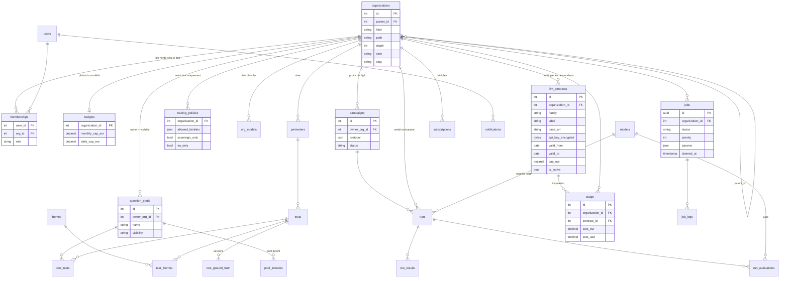

# ADR-089 — Modèle cible pour l'échelle ministérielle et interministérielle

- **Statut** : Acceptée (2026-10-02), arbitrages validés par Bertrand Matge
- **Dépend de** : ADR-076 (historique inviolable), ADR-077 (multi-tenant, rôles), ADR-078 (BYOK),
  ADR-080 (OpenRouter, coût réel), ADR-086 (auth applicative, OIDC), ADR-088 (stack conservée,
  API first, cible Nubo)
- **Schémas** : [`docs/architecture.md`](../architecture.md)

## 1. Contexte

Le pilote vise un ministère, puis plusieurs. Les besoins exprimés : multi-objets (entité,
thème, site), hiérarchie d'entités (ministère > direction > service), budgets définis par
l'entité supérieure, multi-fournisseurs LLM avec contrats et clés unitaires, pools de
questions regroupables, notifications et retours (question toujours fausse, quota atteint).

Le modèle actuel est plat : `Organization` sans parent, `Perimeter` rattaché à une org,
`Budget` par org, `OrgCredential` par couple org et modèle, tests propriété d'une org.
Tout ce qui suit s'appuie sur une seule décision structurante : la hiérarchie des entités.

## 2. Décisions

### 2.1 Hiérarchie des entités — `parent_id` + chemin matérialisé

`Organization` devient un nœud d'arbre : `parent_id` nullable, `kind` (ministère,
direction, service, autre), `path` texte des identifiants ancêtres (ex. `12/45/78`),
`depth`. Les organisations existantes deviennent des racines sans migration de données.

- Descendants : `WHERE path LIKE '12/%'` indexé ; ancêtres : décomposition du `path`.
  Une CTE récursive reste possible. Aucune extension PostgreSQL requise : on ne connaît pas
  encore les extensions activées sur le Postgres managé Nubo, `ltree` est donc écarté.
- Déplacement d'un nœud : réécriture du `path` du sous-arbre dans une transaction, opération
  rare et administrative.
- `siret` optionnel sur l'entité, pour le rattachement ProConnect (§2.7).

### 2.2 Résolveur unique de paramètres hérités

Une fonction `effective_setting(org, key)` remonte la chaîne des ancêtres et renvoie la
première valeur définie. Elle sert à tous les paramètres hérités : plafond budgétaire,
liste blanche de modèles, politique de routage LLM, contrat ou credential applicable,
destinataires de notifications. Une valeur posée sur un nœud surcharge celle du parent,
jamais au-delà de ce que le parent autorise (une liste blanche enfant ⊆ liste blanche
parent ; une politique de routage ne peut qu'être plus restrictive).

### 2.3 Budgets — plafond consolidé souple

- Le plafond d'une entité (mois, jour) s'applique à sa **dépense consolidée** : elle-même
  plus tous ses descendants.
- Les plafonds des enfants sont **optionnels**. Une entité sans budget propre est contrainte
  par le premier plafond trouvé en remontant.
- `check_budget` vérifie toute la chaîne des ancêtres : un run est refusé si **un** plafond
  consolidé serait dépassé, et le motif nomme l'entité en cause.
- `UsageRecord` garde `organization_id` de l'entité exécutante ; la consolidation est une
  agrégation par préfixe de `path`. Alertes à 80 % et 100 % (§2.8).
- Les enveloppes strictes (allocation explicite, somme des enfants ≤ parent) sont
  écartées pour le pilote : elles obligent à tout allouer avant d'ouvrir un service.

### 2.4 Rôles — hérités vers le bas, définis dans l'application

- Un `membership` sur une entité vaut pour elle **et tous ses descendants**. Le rôle
  effectif sur une entité est le maximum des rôles portés sur la chaîne des ancêtres.
- Délégation : chaque `org_admin` nomme les membres de son sous-arbre, jamais au-dessus.
- L'admin plateforme reste un attribut utilisateur (`users.is_platform_admin`), hors arbre.
- Les trois rôles actuels suffisent au pilote : `org_admin`, `editor`, `viewer`. Un rôle
  `annotator` (vérité terrain et gold set uniquement) est réservé pour la phase suivante.

### 2.5 Pools de questions — référence et portée de visibilité

- Nouvel objet `question_pools` : propriétaire (`owner_org_id`), `visibility` ∈ {`private`,
  `descendants`, `all`}, thèmes, description. Table de liaison `pool_tests` ; un pool peut
  inclure d'autres pools (`pool_includes`), cycle interdit.
- Une entité **exécute** un pool visible sans le copier. Les tests gardent leur
  propriétaire, les `runs` et `run_results` portent l'entité exécutante. Une correction de
  la vérité terrain profite à tous ; l'historique reste intact (ADR-076 : nouvelle version
  de `test_ground_truth`, jamais de réécriture).
- `Perimeter` est conservé comme objet **site** (il porte déjà `kind` et `home_url`) et
  gagne `domains` (liste des domaines officiels à surveiller).
- Les **thèmes** sont des étiquettes transverses (`themes`, `test_themes`,
  `perimeter_themes`), pas un niveau de hiérarchie.
- La copie à l'import est écartée : divergence des réponses attendues, comparaisons
  impossibles.

### 2.6 Fournisseurs LLM — objet contrat

`OrgCredential` est remplacé par `llm_contracts` : entité porteuse, fournisseur (`family`),
libellé (marché, référence), `base_url`, clé chiffrée Fernet, en-têtes, `valid_from` /
`valid_to`, plafond propre optionnel, `is_active`. Un contrat est **hérité par les
descendants** via le résolveur. `UsageRecord` gagne `contract_id` pour l'imputation.

La cascade de `client_for_model` devient : contrat de l'entité ou d'un ancêtre pour cette
famille → configuration du modèle → secret plateforme. OpenRouter reste le contrat
plateforme par défaut ; un ministère peut poser son propre contrat Mistral, Albert ou
OpenRouter, et ses services en héritent.

**Politique de routage** par entité (héritée, restrictive uniquement) : fournisseurs
autorisés, souverain obligatoire ou non, hébergement hors UE interdit ou non. Vérifiée au
lancement comme la liste blanche.

### 2.7 Identité ProConnect — authentifie, n'habilite pas

- ProConnect fournit `sub`, email, nom, prénom, `siret`, `idp_id`. Aucun `groups`. Les
  habilitations vivent dans l'application (§2.4). Les promotions par groupe fournisseur
  restent des mécanismes transitoires opt-in (PR #42).
- Clé de rattachement technique : `(oidc_issuer, sub)`, pas l'email, qui change avec les
  mutations.
- Le `siret` **propose** un rattachement à l'entité correspondante ; un `org_admin` valide
  et choisit le rôle. Jamais d'attribution automatique.
- Le `siret` est relu à chaque connexion ; une divergence avec les entités de l'utilisateur
  est signalée aux administrateurs pour revue. Aucune révocation automatique.

### 2.8 Notifications et retours

- Table `notifications` (destinataire, entité, type, charge utile, lu) et `subscriptions`
  (entité, type, canal, destinataires, héritées). Canaux pilote : dans l'application et
  email ; webhook générique ensuite (Tchap, outils ministériels).
- Événements : quota à 80 % et 100 %, run en échec, clé ou contrat expirant, juge
  indisponible, **question récurremment fausse** (N derniers runs sous un seuil pour un
  couple test et modèle), chute de la part de citations vers les domaines du site.
- Les détecteurs tournent dans le worker, après chaque évaluation, et n'écrivent que des
  notifications : ils ne modifient jamais un résultat.
- Retours humains : les annotations gold existantes deviennent un flux de **signalement**
  (« réponse attendue douteuse », « citation hors sujet ») rattaché au test et visible par
  le propriétaire du pool.

### 2.9 Ce que l'échelle impose en plus

- **Campagnes** : un protocole figé (pools, modèles et versions, juges, prompts, fréquence)
  défini par une entité et exécuté par ses descendants, pour des résultats comparables.
- **Cycle de vie des questions** : brouillon → validée → publiée → retirée, avec un
  propriétaire métier qui approuve la réponse attendue.
- **Juges** : versions épinglées par campagne ; rejuger un historique crée de nouvelles
  évaluations, n'écrase rien ; jeux de calibration par domaine et suivi de l'accord
  juge / humains dans le temps.
- **Exploitation** : file de jobs avec priorité et équité entre entités, limitation de
  débit par contrat, partitionnement mensuel de `run_results` et `run_evaluations`,
  archivage, export ouvert agrégé.
- **Conformité** : journal de tout envoi vers un fournisseur externe, rétention, RGAA,
  homologation, registre des traitements pour les comptes.

## 3. Modèle de données cible

Tables existantes conservées telles quelles : `users`, `auth_tokens`, `invitations`,
`audit_log`, `models`, `model_pricing`, `scheduled_runs`, `prompt_types`,
`evaluation_prompts`, `gold_annotations`, `run_results`, `run_evaluations`.
`org_credentials` migre vers `llm_contracts` (lecture des deux pendant une version).

## 4. Pilote ou interministériel

| Capacité | Pilote (un ministère) | Interministériel |
|---|---|---|
| Hiérarchie, résolveur, rôles hérités | ✔ | ✔ |
| Budget consolidé souple + alertes | ✔ | enveloppes strictes si demandé |
| Pools par référence, thèmes, sites | ✔ | ✔ |
| Contrats LLM, politique de routage | ✔ (un contrat plateforme + contrats ministère) | ✔ |
| ProConnect, rattachement par `siret` proposé | ✔ | ✔ |
| Notifications app + email, détecteur « toujours faux » | ✔ | webhooks, digests |
| Campagnes et cycle de vie des questions | minimal (statut publié / retiré) | complet |
| Partitionnement, priorité et équité, export ouvert | — | ✔ |
| Refacturation par contrat | showback | chargeback |

## 5. Conséquences

- Les chantiers du lot 1 (ADR-088) absorbent ces décisions : le worker lit `jobs` avec
  `priority` ; le découpage API/UI expose entités, pools, contrats et campagnes en API v1 ;
  Alembic porte les migrations ci-dessus.
- Aucune donnée historique n'est réécrite : les orgs existantes deviennent des racines, les
  credentials migrent vers des contrats, les runs gardent leur entité.
- `effective_setting` est la seule porte d'entrée pour un paramètre hérité ; un contrôleur
  qui lit directement `budgets` ou `org_models` est un défaut.
- Cette ADR est amendée quand les réponses Nubo (extensions PostgreSQL, egress) sont
  connues, et quand le premier ministère pilote précise sa structure.
