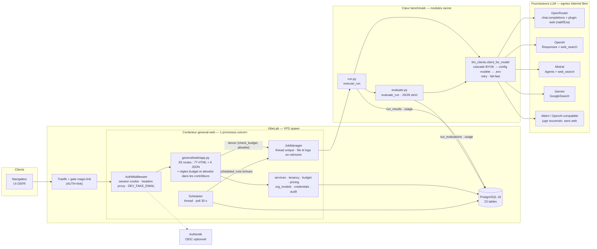
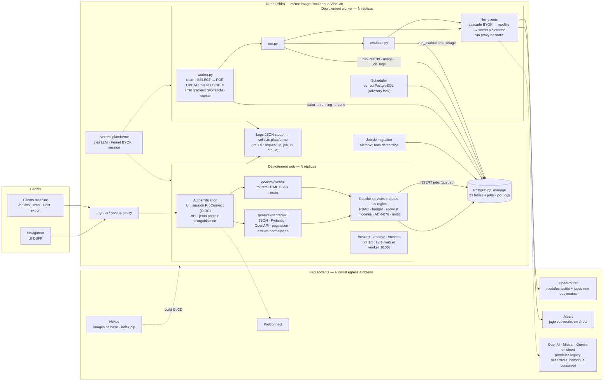
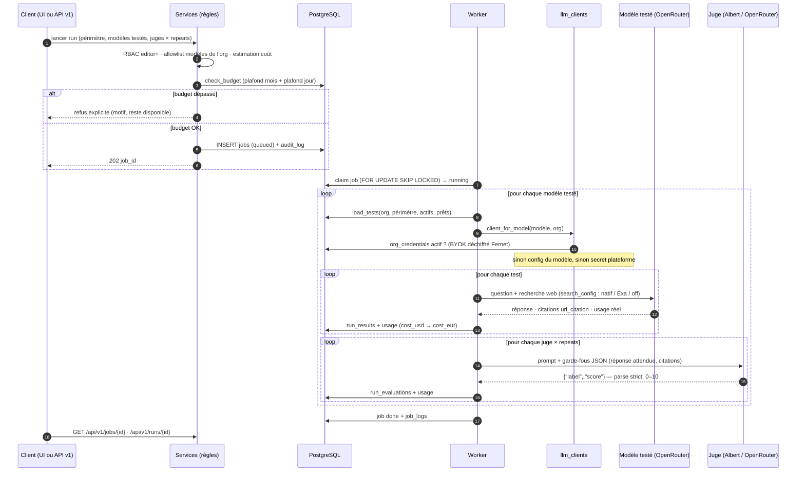

# Architecture logique GEOeval — POC actuel et cible pilote

Document de référence lié à [ADR-088](adr/ADR-088-stack-conservee-refacto-incremental-nubo.md)
et [ADR-089](adr/ADR-089-modele-cible-echelle-ministerielle.md) (modèle de données cible pour l'échelle).
Les diagrammes sont en Mermaid (rendus par GitHub). Trois vues : l'existant, la cible, le
déroulé d'un run. Puis deux tableaux : où vivent les règles métier, et comment on atteint
chaque fournisseur LLM.

## 1. Existant (POC sur VibeLab, avant le lot 1.2)

Un seul processus uvicorn porte tout : les routes HTML, le worker de runs (thread) et le
planificateur (thread). Les règles métier sont réparties entre la couche services et les
contrôleurs de `geoeval/web/app.py`.

Limites visibles sur ce schéma (levées par le lot 1.2 : table `jobs`, processus
`geoeval.worker.main`, verrou consultatif pour le planificateur) : un redémarrage perdait la
file et les logs de jobs ; deux réplicas auraient doublé le planificateur ; les contrôles budget et allowlist ne protègent que
le chemin HTML ; l'egress n'est pas filtré.

## 2. Cible pilote (lot 1 + API first + lot 2 Nubo)

Même image Docker, trois rôles de déploiement : **web**, **worker**, **migration**. L'API
v1 et l'UI consomment la même couche services, qui porte toutes les règles. Le worker lit
une table `jobs` en base avec un verrou PostgreSQL. Les secrets, les logs et les sondes
sont ceux de la plateforme.

Principe API first : toute fonctionnalité existe d'abord dans `geoeval/web/api/v1`
(livré : 1.3b lecture, lancement, jobs, jetons ; 1.3c écriture du corpus et des planifications). L'UI ne
peut rien faire que l'API ne permette pas. L'UI n'appelle pas l'API en HTTP : les deux
partagent la couche services, qui est le seul endroit où vivent les règles.

## 3. Déroulé d'un run (cible)

Les erreurs LLM non transitoires (401, 403, 404, 422, 429 quota dur) remontent
immédiatement en `LLMCallError` ; les autres sont réessayées avec backoff et jitter.

## 4. Règles métier : où elles vivent

| Règle | Source | Aujourd'hui | Cible API first |
|---|---|---|---|
| RBAC trois rôles + admin plateforme | ADR-077 | `geoeval/web/deps.py` (dépendances FastAPI) | Dépendances partagées API et UI, rôle porté par le jeton ou la session |
| Lecture publique des tableaux de bord | ADR-087 | `deps.public_org` | Idem, endpoints API en lecture sans jeton |
| Plafond budget mois et jour | ADR-080 | `geoeval/web/launching.py` (lot 1.3a ; aussi appliqué à « exécuter maintenant ») | Idem, exposé par l'API v1 (lot 1.3b) |
| Liste blanche des modèles par org | EPIC-001 | `geoeval/web/launching.py` (lot 1.3a) | Idem |
| Échéances des planifications, réactivation d'un one-shot passé | — | `geoeval/web/scheduling.py` (lot 1.3c) | Idem |
| Historique inviolable : désactivation, jamais suppression | ADR-076 | `services.delete_model` refuse si runs référencés ; tests désactivés | Inchangé, exposé tel quel dans l'API (pas de DELETE sur runs) |
| Cascade des clés BYOK → modèle → plateforme | ADR-078 | `llm_clients._byok_override` | Inchangé ; secret plateforme fourni par Nubo |
| Retry, fail-fast, quota dur | — | `llm_clients.call_with_retry` | Inchangé |
| Sortie JSON stricte des juges, score 0–10 | ADR-079 | `evaluate.parse_judge_output` | Inchangé |
| Coût réel USD → EUR à l'ingestion | ADR-080 §6.3 | `geoeval/web/usage.record` | Inchangé |
| Journal d'audit | ADR-077 | `geoeval/web/audit.record` depuis les contrôleurs | Appelé depuis les services |
| Sérialisation des runs (quotas API) | — | Thread unique | Concurrence bornée par fournisseur dans le worker |

Lot 1.3a : le contrôle budget et la liste blanche ont quitté les contrôleurs HTML pour le
service `launching`, que l'UI et l'API v1 appelleront à l'identique. Reste à traiter : le
tick du planificateur ne revérifie pas le budget au moment de l'exécution (chantier E7,
notifications : sauter et prévenir plutôt que lancer).

## 5. Routes vers les fournisseurs LLM

| Famille (`models.model_name`) | SDK / API | Recherche web | Rôle | Cible |
|---|---|---|---|---|
| `openrouter` | `openai` (base_url OpenRouter), `chat.completions` + `plugins: web` | natif ou Exa, par modèle (`search_config`) | testé et juge | **défaut pour tous les modèles testés** (ADR-080) |
| `albert` / `openai-compatible` | `openai` (base_url Albert), `chat.completions` | aucune | juge souverain | conservé en direct |
| `openai` / `chatgpt` / `gpt` | `openai`, API Responses + `web_search` | native, geo FR-Paris | testé, juge | legacy, désactivé après bascule |
| `mistral` | `mistralai`, API Agents + `web_search` | native | testé, juge | legacy |
| `gemini` / `google` | `google-genai`, `GoogleSearch` | native | testé, juge | legacy |

Chaque famille résout sa clé par la même cascade : clé BYOK de l'organisation si active,
sinon `base_url` / `api_key` du modèle en base, sinon variable d'environnement. Sur Nubo,
tous ces appels passent par le proxy de sortie et l'allowlist egress ; c'est la question à
poser en premier (ADR-088 §2.4).
